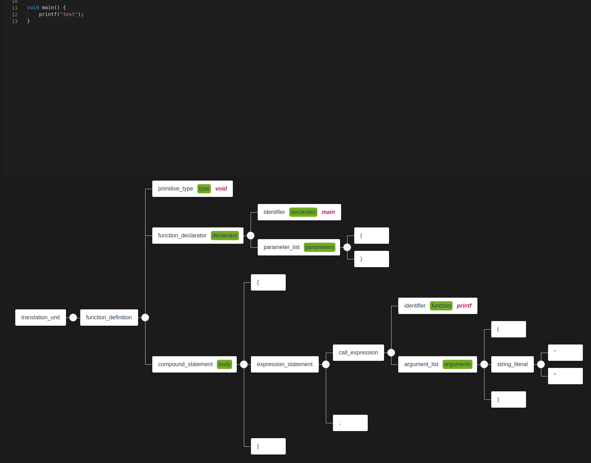

## a rust lib to visualize tree-sitter syntax tree




## prerequisite

* git clone this project

* install npm / node.js

## build and run example

* `cd frontend`, run `npm i --save` and `npm run build`

* `cd ..`, run `cargo run --example cpp_example`

* visit `http://127.0.0.1:8000/`

## usage

see examples/cpp_example.rs

```rust
extern crate tree_sitter_cpp;
extern crate tree_sitter_viewer;

#[tokio::main]
async fn main() -> Result<(), rocket::Error> {

    // initial code to display
    let code = r#"void main() {
        printf("test");
    }"#;

    // specify the parser's language and the initial code.
    let result = tree_sitter_viewer::run(tree_sitter_cpp::language(), code );

    result.await
}

```

## label / legend explanation 

* black/plain text: A tree node's [kind](https://docs.rs/tree-sitter/0.20.0/tree_sitter/struct.Node.html#method.kind) 
* with green background: A tree node's [field_name](https://docs.rs/tree-sitter/0.20.0/tree_sitter/struct.TreeCursor.html#method.field_name), if there is one
* pink, italic: the actual content of a node, only a leaf node / terminal will show this.